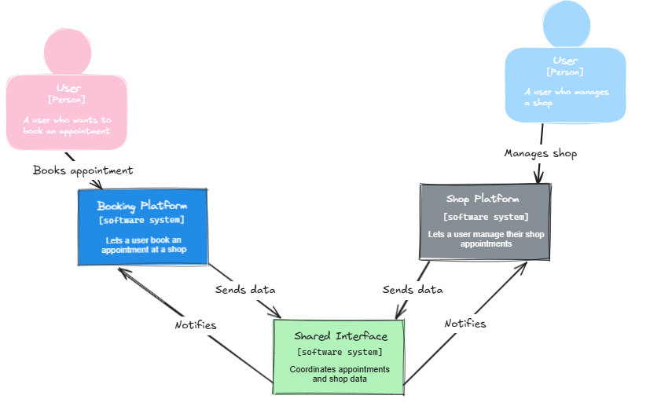
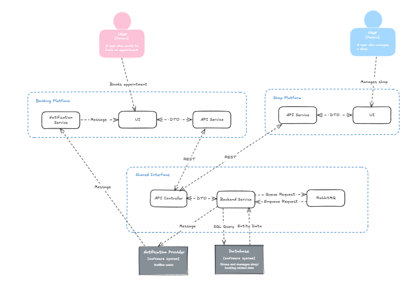

# Booking System
The main concept of the booking system project is the possibility for a user to book an appointment at a shop which offers several services. 

A user should be able to choose multiple services and select a desired employee for each. After this step, the order can be completed and the user will receive a notification regarding the date and time of the appointment.

A shop owner should be able to manage available services, employees and view appointments in a dashbord.

## Structure
This project consists of two platforms and one shared backend. 
- The *booking platform* is a web application for a user to book services and get an appointment at a shop. The related code is located in *booking-app*.
- The *shop platform* is a web application for a shop owner to manage available services, employees and view appointments. The related code is located in *management-app*.
- The *shared interface* describes the shared backend infrastructure, which contains all data and necessary API routes to use both platforms. The related code is located in *vector*.

*Context diagram*

*Container diagram*